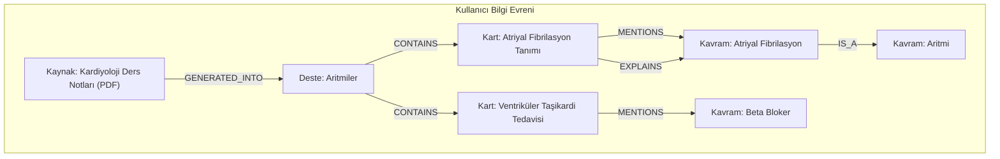

# Akıllı Merkezi Beyin: Detaylı Teknik Plan

Bu doküman, SourceBase uygulamasının "akıllı" özelliklerini destekleyecek olan **Bilgi Grafiği (Knowledge Graph)** ve **Vektör Benzerliği (Vector Similarity)** altyapılarının teknik detaylarını ve uygulama stratejisini açıklamaktadır.

---

## Bölüm 1: Vektör Benzerliği ve Anlamsal Arama Altyapısı

**Amaç:** Kullanıcının tüm metin bazlı varlıkları (kaynaklar, kartlar, notlar) arasında anlamsal arama yapmasını sağlamak ve birbiriyle ilgili içerikleri proaktif olarak önermek.

### 1.1. Teknik Mimari

Bu mimari, Supabase ekosistemini (özellikle `pgvector` eklentisi) ve Vertex AI'ın embedding modellerini kullanarak, hem verimli hem de ölçeklenebilir bir çözüm sunar.

```mermaid
graph TD
    A[Kullanıcı İçeriği: source, card, note] -->|Yeni/Güncel| B(Supabase Edge Function: 'embed-and-store');
    B --> C{Vertex AI: text-embedding-model};
    C -->|Vektör (Embedding)| B;
    B --> D[Supabase DB: pgvector];

    subgraph Anlamsal Arama ve Öneri
        E[Kullanıcı Sorgusu/İçeriği] --> F(Supabase Edge Function: 'find-similar');
        F --> G{Vertex AI: text-embedding-model};
        G -->|Sorgu Vektörü| F;
        F --> H(Supabase DB: pgvector - similarity search);
        H -->|Benzer İçerik ID'leri| F;
        F --> I[İlgili İçerikler];
    end
```

**Akışın Açıklaması:**
1.  **Embedding ve Saklama:** Bir `source`, `card` veya gelecekte eklenecek `note` gibi bir varlık oluşturulduğunda veya güncellendiğinde, bir Supabase Edge Function tetiklenir.
2.  Bu function, ilgili metin içeriğini Google Vertex AI'ın embedding modeline gönderir.
3.  Vertex AI, metni sayısal bir vektöre (embedding) dönüştürür.
4.  Bu vektör, Supabase veritabanında, ilgili varlığın yanında özel bir `vector` kolonunda saklanır. (`pgvector` eklentisi sayesinde)
5.  **Arama ve Öneri:** Kullanıcı bir arama yaptığında veya bir içeriğe baktığında, bu metin de aynı süreçle bir "sorgu vektörüne" dönüştürülür.
6.  `pgvector`'ün `cosine similarity` veya `inner product` gibi fonksiyonları kullanılarak, veritabanındaki tüm vektörler arasında bu sorgu vektörüne en yakın olanlar (yani anlamsal olarak en benzer olanlar) bulunur.
7.  Sonuç olarak, kullanıcıya en ilgili içeriklerin bir listesi sunulur.

### 1.2. Veritabanı Değişiklikleri

Mevcut `sources` ve `cards` tablolarına bir `vector` kolonu eklenecektir.

**Gerekli SQL Komutları:**

```sql
-- Supabase dashboard'da pgvector eklentisini aktif et.
-- create extension vector;

-- Tablolara vektör kolonunu ekle
ALTER TABLE sourcebase.sources ADD COLUMN embedding vector(768); -- Vertex AI modelinin boyutuna göre (ör: 768)
ALTER TABLE sourcebase.cards ADD COLUMN embedding vector(768);

-- Vektörler üzerinde hızlı arama için IVFFlat index'i oluştur
CREATE INDEX ON sourcebase.sources USING ivfflat (embedding vector_cosine_ops) WITH (lists = 100);
CREATE INDEX ON sourcebase.cards USING ivfflat (embedding vector_cosine_ops) WITH (lists = 100);
```

### 1.3. Uygulama Adımları (TODO Listesi)

- [ ] **Altyapı:** Supabase projesinde `pgvector` eklentisini etkinleştir.
- [ ] **Veritabanı:** Yukarıdaki SQL komutlarını içeren yeni bir migration dosyası oluştur ve çalıştır.
- [ ] **Backend (Edge Function):**
    - [ ] `embed-and-store`: Bir varlık (source, card) ID'si ve metin içeriği alıp, Vertex AI'dan embedding üreten ve ilgili tabloyu güncelleyen bir Edge Function oluştur.
    - [ ] `find-similar`: Bir metin veya varlık ID'si alıp, veritabanında anlamsal arama yaparak en benzer N sonucu döndüren bir Edge Function oluştur.
- [ ] **Entegrasyon:**
    - [ ] `sources` ve `cards` tabloları için `INSERT` ve `UPDATE` olaylarında `embed-and-store` function'ını tetikleyecek database trigger'ları (veya RPC çağrıları) ekle.
    - [ ] Geçmiş veriler için (mevcut tüm `sources` ve `cards`), embedding'leri oluşturacak bir backfill script'i yaz.
- [ ] **Frontend:**
    - [ ] Arama çubuğunu, `find-similar` function'ını çağıracak şekilde güncelle.
    - [ ] Bir kart veya kaynak görüntülendiğinde, ilgili içerikleri (örneğin bir sidebar'da) göstermek için `find-similar`'ı kullan.

---

## Bölüm 2: Bilgi Grafiği (Knowledge Graph)

**Amaç:** Kullanıcının bilgi evrenini, sadece anlamsal benzerliğe göre değil, aynı zamanda yapısal ve kavramsal ilişkilere göre de modellemek. Bu, "bu kart hangi ana konuya ait?", "bu konuyla ilgili başka hangi destelerim var?" gibi sorulara yanıt vermemizi sağlar.

### 2.1. Konsept ve Veri Modeli

Bilgi Grafiği, temel olarak üç bileşenden oluşur:

1.  **Düğümler (Nodes):** Bilgi birimleri. Bizim durumumuzda bunlar:
    *   `Source` (Kaynak Doküman)
    *   `Deck` (Flashcard Destesi)
    *   `Card` (Tekil Flashcard)
    *   `Concept` (Soyut Kavram, ör: "Kardiyoloji", "Diferansiyel Denklemler")
2.  **Kenarlar (Edges):** Düğümler arasındaki ilişkiler. Örnek ilişkiler:
    *   `source` --[:GENERATED_INTO]--> `deck` (Bu kaynaktan bu deste üretildi)
    *   `deck` --[:CONTAINS]--> `card` (Bu deste bu kartı içerir)
    *   `card` --[:MENTIONS]--> `concept` (Bu kart bu kavramdan bahsediyor)
    *   `concept` --[:IS_PART_OF]--> `concept` (Alt kavram, üst kavram ilişkisi. ör: "Atriyal Fibrilasyon" --[:IS_PART_OF]--> "Aritmiler")
3.  **Özellikler (Properties):** Düğümlerin ve kenarların meta verileri (ör: oluşturulma tarihi, zorluk seviyesi vb.)



### 2.2. Teknik Çözüm

PostgreSQL'in ilişkisel yapısı bu tür bir graf yapısı için yetersiz kalabilir. Bu nedenle iki ana seçenek değerlendirilmelidir:

*   **Seçenek A (Basit Başlangıç):** PostgreSQL'de `concepts` ve `relationships` adında iki yeni tablo oluşturmak.
    *   **`concepts` (`id`, `name`, `description`)
    *   **`concept_relationships` (`source_node_type`, `source_node_id`, `target_node_type`, `target_node_id`, `relationship_type`)
    *   **Avantaj:** Mevcut altyapıda kalır, hızlıca implemente edilebilir.
    *   **Dezavantaj:** Derin ve karmaşık sorgular (örn: 3-4 seviye derinliğindeki ilişkileri bulma) yavaş ve verimsiz olabilir.

*   **Seçenek B (Ölçeklenebilir Çözüm):** Yönetilen bir Graph Database servisi kullanmak (örn: [Neo4j AuraDB](https://neo4j.com/cloud/platform/aura-database/), [Amazon Neptune](https://aws.amazon.com/tr/neptune/)).
    *   **Avantaj:** Grafik sorguları için optimize edilmiştir (Cypher sorgu dili). Karmaşık ilişkileri ve kalıpları çok hızlı bir şekilde bulabilir. Ölçeklenmesi daha kolaydır.
    *   **Dezavantaj:** Yeni bir teknoloji ve ek maliyet getirir. Sisteme yeni bir bağımlılık ekler.

**Öneri:** **Seçenek A** ile başlayıp, sistemin temel mantığını oturtmak. Eğer grafik sorguları performans darboğazı yaratmaya başlarsa veya daha karmaşık ilişki analizi senaryoları gerekirse **Seçenek B**'ye geçiş için bir plan hazırlamak.

### 2.3. Uygulama Adımları (TODO Listesi - Seçenek A)

- [ ] **Veritabanı:**
    - [ ] `concepts` tablosunu oluştur.
    - [ ] `concept_relationships` tablosunu oluştur.
    - [ ] Gerekli index'leri ekle.
- [ ] **Backend (Edge Function):**
    - [ ] `extract-concepts`: Verilen bir metin (source, card) içerisindeki anahtar kavramları (concepts) ve aralarındaki ilişkileri LLM (Vertex AI) kullanarak çıkaran bir function oluştur. Bu function, hem `concepts` hem de `concept_relationships` tablolarını doldurur.
    - [ ] `get-knowledge-graph`: Belirli bir kullanıcı veya konu etrafındaki bilgi grafiğini sorgulayan ve görselleştirme için uygun formatta (örn: nodes ve edges listesi) döndüren bir function oluştur.
- [ ] **Entegrasyon:**
    - [ ] Varlıklar (source, card) oluşturulduğunda `extract-concepts` function'ını tetikle.
    - [ ] Geçmiş veriler için kavramları çıkaracak bir backfill script'i yaz.
- [ ] **Frontend:**
    - [ ] Bilgi grafiğini görselleştirecek bir component tasarla (örn: `react-force-graph` veya benzeri bir kütüphane ile).
    - [ ] Kullanıcının kendi bilgi evreninde gezinmesine, konular arası bağlantıları keşfetmesine olanak sağla.

---

## Bölüm 3: Sonraki Adımlar ve Planın Onaylanması

Bu detaylı plan, uygulamanın "Akıllı Merkezi Beyin" vizyonunu gerçekleştirmek için sağlam bir temel oluşturmaktadır. Vektör arama ile hızlı ve anlamsal öneriler sunarken, bilgi grafiği ile de derinlemesine bir içerik anlayışı ve keşif yeteneği kazandırılacaktır.

**Önerilen Yol Haritası:**
1.  **Faz 1 (Vektör Altyapısı):** Bölüm 1'deki adımları tamamla.
2.  **Faz 2 (Bilgi Grafiği - Temel):** Bölüm 2'deki Seçenek A'yı (PostgreSQL tabanlı) uygula.
3.  **Faz 3 (Öneri Servisleri):** Bu iki altyapıyı kullanarak Bölüm 4, 5, 6'daki akıllı özellikleri geliştir.
4.  **Faz 4 (Optimizasyon):** Performans ve kullanıcı geri bildirimlerine göre, Bilgi Grafiği için Seçenek B'ye (Neo4j vb.) geçişi değerlendir.

Bu planın onaylanmasının ardından, **Faz 1**'in ilk adımı olan "Supabase projesinde `pgvector` eklentisini etkinleştirme" görevi için bir `code` task'i oluşturulabilir.

---

## Bölüm 4: Kullanıcı Deneyimi ve Tasarım Entegrasyonu (UX/UI)

**Amaç:** Geliştirilen akıllı altyapı özelliklerini, kullanıcı için anlaşılır, kullanışlı ve sezgisel bir arayüze dönüştürmek.

### 4.1. Anlamsal Arama (Vektör Benzerliği)

*   **Mevcut Arama Çubuğunun Geliştirilmesi:**
    *   Kullanıcı arama yaptığında, sonuçlar sadece kelime eşleşmesine göre değil, anlamsal yakınlığa göre de sıralanmalıdır.
    *   **Tasarım Detayı:** Arama sonuçları listesindeki her bir öğe (`ListTile`) genişletilebilir bir tasarıma sahip olabilir. Başlıkta içeriğin adı ve türü (kart, deste, kaynak) yer alırken, alt başlıkta (subtitle) içeriğin kısa bir önizlemesi ve sağ tarafında ise anlamsal benzerlik skoru (`Chip` widget'ı içinde "Rel: 92%") gösterilebilir.
    *   **Flutter Karşılığı:** `SearchDelegate` sınıfı özelleştirilebilir, sonuçlar için `ListView.builder` içinde `Card` ve `ExpansionTile` widget'ları kullanılabilir.

*   **"İlgili İçerikler" Bileşeni:**
    *   Kullanıcı bir kartı, desteyi veya kaynak dokümanı görüntülerken, sayfanın bir bölümünde (örneğin sağ sidebar veya alt kısım) anlamsal olarak benzer diğer içerikler listelenmelidir.
    *   **Tasarım Detayı:** "İlişkili Kartlar ve Notlar" başlığı altında, yatayda kaydırılabilen (`SingleChildScrollView`) bir `Card` listesi sunulabilir. Her kart, içeriğin başlığını ve türünü belirten bir ikonu (`Icons.article`, `Icons.style`) içerebilir. Tıklandığında içeriğe pürüzsüz bir geçiş (`Navigator.push`) sağlanmalıdır.
    *   **Flutter Karşılığı:** `FutureBuilder` ile ilgili içerikler yüklenir, `SizedBox` ile sınırlanmış bir yükseklikte `ListView` veya `GridView` ile gösterilir.

### 4.2. Bilgi Grafiği Keşfi

*   **"Bilgi Evrenim" Sayfası:**
    *   Kullanıcının tüm içeriklerinin ve aralarındaki ilişkilerin görselleştirildiği interaktif bir sayfa tasarlanmalıdır.
    *   **Tasarım Detayı:** Bu ekran, başlangıçta kullanıcının en çok etkileşimde bulunduğu konuları merkezde gösteren dinamik bir grafikle açılır. Kullanıcı, parmak hareketleriyle (`gestures`) grafiği kaydırabilir, yakınlaştırıp uzaklaştırabilir. Bir düğüme dokunduğunda (`onTap`), o düğüm merkezlenir ve bağlantılı olduğu diğer düğümler belirginleşir. Ekranda ayrıca, seçilen düğüm hakkında detaylı bilgilerin (tanım, ilgili kart sayısı vb.) gösterildiği bir alt panel (`BottomSheet`) açılabilir.
    *   **Flutter Karşılığı:** `graphview` veya `force_directed_graph` gibi paketler kullanılabilir. `InteractiveViewer` widget'ı, pan ve zoom özellikleri için temel oluşturur.

*   **Kavram (Concept) Sayfaları:**
    *   Bilgi grafiğindeki her bir `Concept` (kavram) için otomatik olarak bir sayfa oluşturulabilir.
    *   **Tasarım Detayı:** Sayfanın en üstünde kavramın adı (`Text` widget, `headlineMedium` stiliyle) ve LLM tarafından üretilmiş kısa bir tanım yer alır. Altında, "Bu Kavramı İçeren Kartlar", "Bu Kavramla İlişkili Desteler" ve "İlgili Diğer Kavramlar" gibi bölümlere ayrılmış, `ExpansionPanelList` ile açılıp kapanabilen listeler bulunur. Her liste öğesi, ilgili içeriğe doğrudan bir bağlantı sunar.
    *   **Flutter Karşılığı:** `CustomScrollView` ve `SliverList` ile performanslı bir kaydırma deneyimi sağlanır. İçerik listeleri için `ListView.separated` kullanılabilir.

### 4.3. Proaktif Öneriler ve Bildirimler

*   **Akıllı Tekrar Hatırlatmaları:**
    *   Kullanıcının `study_progress` verilerine dayanarak, kişiselleştirilmiş hatırlatmalar sunulmalıdır.
    *   **Tasarım Detayı:** Ana ekranda (`HomeScreen`), kullanıcının profil resminin altında veya özel bir "Sana Özel" bölümünde, yatay kaydırılabilen `Card` widget'ları ile öneriler sunulur. Örneğin, bir kartta "Bugün tekrar etmen gereken 5 kartın var. Başla!" yazarken, diğer bir kartta "'Farmakoloji' destesindeki bu 3 kartta zorlanıyorsun. Tekrar göz atalım mı?" yazabilir. Her kartın bir eylem düğmesi (`ElevatedButton`) olmalıdır.
    *   **Flutter Karşılığı:** `CarouselSlider` veya `PageController` ile yönetilen bir `PageView` bu tasarım için uygundur.

*   **İçerik Tamamlama Önerileri:**
    *   Sistem, bir destedeki bilgi boşluklarını tespit ettiğinde kullanıcıya öneride bulunabilir.
    *   **Tasarım Detayı:** Deste görüntüleme ekranında, kart listesinin sonunda, `Card` içinde bir `ListTile` ile bir öneri sunulur. Örneğin, `leading` kısmında bir ampul ikonu (`Icons.lightbulb_outline`), `title` kısmında "Bu desteyi daha da zenginleştir!" ve `subtitle` kısmında "'Beta Blokerler' hakkında bir kart eklemeye ne dersin?" yazar. Tıklandığında, ilgili kart oluşturma ekranına, başlık önceden doldurulmuş olarak yönlendirilir.
    *   **Flutter Karşılığı:** `ListView`'in sonuna eklenmiş statik bir `Card` veya `Ad` widget'ı gibi düşünülebilir.


*   **Mevcut Arama Çubuğunun Geliştirilmesi:**
    *   Kullanıcı arama yaptığında, sonuçlar sadece kelime eşleşmesine göre değil, anlamsal yakınlığa göre de sıralanmalıdır.
    *   **Tasarım Fikri:** Sonuç listesinde, her bir sonucun yanında bir "benzerlik skoru" (örneğin %95 ilgili) veya görsel bir bar ile ne kadar ilişkili olduğu gösterilebilir.

*   **"İlgili İçerikler" Bileşeni:**
    *   Kullanıcı bir kartı, desteyi veya kaynak dokümanı görüntülerken, sayfanın bir bölümünde (örneğin sağ sidebar) anlamsal olarak benzer diğer içerikler listelenmelidir.
    *   **Tasarım Fikri:** Bu bileşen, "Bunlar da ilginizi çekebilir" başlığı altında, her bir önerinin neden ilgili olduğuna dair küçük ipuçları (ör: "Bu kart da 'atriyal fibrilasyon' kavramını içeriyor") gösterebilir.

### 4.2. Bilgi Grafiği Keşfi

*   **"Bilgi Evrenim" Sayfası:**
    *   Kullanıcının tüm içeriklerinin (kaynaklar, desteler, kartlar, kavramlar) ve aralarındaki ilişkilerin görselleştirildiği interaktif bir sayfa tasarlanmalıdır.
    *   **Tasarım Fikri:** `react-force-graph` gibi bir kütüphane kullanılarak, kullanıcıların düğümlere tıklayıp yeni bağlantıları keşfedebileceği, ağ üzerinde gezinebileceği dinamik bir arayüz oluşturulabilir. Kullanıcı bir düğüme (ör: "Aritmiler" kavramı) tıkladığında, o kavrama bağlı tüm kartları ve desteleri görebilmelidir.

*   **Kavram (Concept) Sayfaları:**
    *   Bilgi grafiğindeki her bir `Concept` (kavram) için otomatik olarak bir sayfa oluşturulabilir. Bu sayfa, o kavramın tanımını, o kavramı içeren tüm kartları/desteleri ve ilişkili diğer kavramları listeler.
    *   **Tasarım Fikri:** Wikipedia benzeri bir yapıda, kullanıcının bilgi derinliğine inmesine olanak tanıyan bir tasarım düşünülebilir.

### 4.3. Proaktif Öneriler ve Bildirimler

*   **Akıllı Tekrar Hatırlatmaları:**
    *   Kullanıcının `study_progress` verilerine dayanarak, "Bugün tekrar etmen gereken 5 kart var" veya "'Farmakoloji' destesindeki bu kartlarda zorlanıyorsun, göz atmak ister misin?" gibi bildirimler gösterilmelidir.
    *   **Tasarım Fikri:** Ana sayfada veya bildirim merkezinde kişiselleştirilmiş bir "Bugünün Görevleri" alanı oluşturulabilir.

*   **İçerik Tamamlama Önerileri:**
    *   Sistem, bir destedeki bilgi boşluklarını veya eksik bağlantıları tespit ettiğinde kullanıcıya öneride bulunabilir.
    *   **Tasarım Fikri:** Deste sayfasında "Bu desteyi daha da zenginleştir!" başlığı altında, "'Beta Blokerler' hakkında bir kart eklemeye ne dersin?" gibi eyleme geçirilebilir öneriler sunulabilir.

### 4.4. Uygulama Adımları (TODO Listesi)

- [ ] **Tasarım/Prototip:**
    - [ ] Yukarıda belirtilen arayüz bileşenleri için Lo-Fi/Hi-Fi tasarımlar (Figma vb.) oluştur.
    - [ ] Kullanıcı akışlarını ve etkileşim senaryolarını tanımla.
- [ ] **Frontend (Flutter):**
    - [ ] İlgili backend servislerini (`find-similar`, `get-knowledge-graph` vb.) çağıran servis katmanlarını oluştur.
    - [ ] Tasarıma uygun olarak yeni ekranları ve bileşenleri (İlgili İçerikler sidebar'ı, Bilgi Evrenim sayfası vb.) geliştir.
    - [ ] Bildirimleri ve proaktif önerileri gösterecek UI elementlerini ekle.
- [ ] **Kullanıcı Testleri:**
    - [ ] Geliştirilen yeni arayüzlerin prototiplerini veya ilk versiyonlarını kullanıcılarla test ederek geri bildirim topla ve iyileştirmeler yap.
