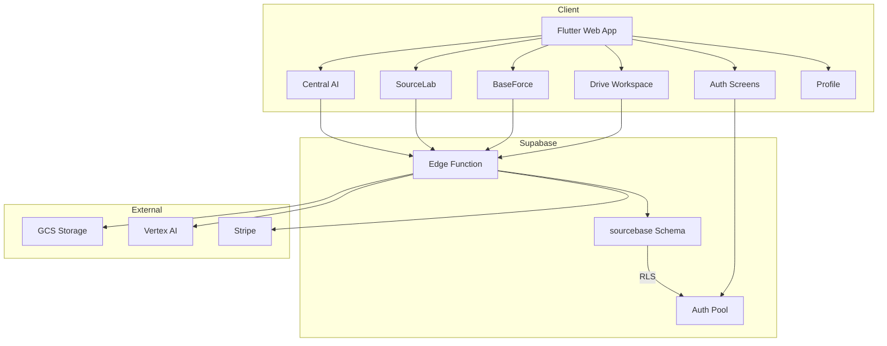

# SourceBase Production Plan

**Date**: 2026-05-16
**Status**: Planning Phase
**Goal**: Bring SourceBase from prototype (~65-75% functional) to production-ready (~95%+ functional)

---

## Current State Analysis

Based on the 1000-line assessment and code review:

### What Works Today ✅
1. **Auth System**: Login, register, email verification, password reset, OAuth (Google/Apple)
2. **Drive Workspace**: Course/section/file CRUD, workspace navigation
3. **File Upload**: GCS signed URL flow, file picker (PDF/PPT/DOCX/ZIP)
4. **Database Schema**: Basic tables (courses, sections, drive_files, generated_outputs, audit_logs)
5. **RLS Policies**: Owner-based access control on all tables
6. **Edge Function**: Action router, auth, drive actions, upload session management
7. **Docker Deploy**: Multi-stage build, Nginx serving, healthcheck
8. **UI/UX**: Drive, BaseForce, SourceLab screens with modern design

### What Needs Completion ❌
1. **AI Generation**: Real Vertex AI integration, content generation (currently demo/placeholder)
2. **File Extraction**: PDF/DOCX/PPTX text extraction (currently basic regex-based)
3. **Study System**: Spaced repetition, study sessions, progress tracking
4. **Marketplace**: Products, purchases, entitlements, Stripe integration
5. **Deck/Card Model**: Flashcard data model exists in migration but not connected to UI
6. **App Memberships**: Role-based access control table exists but not enforced
7. **Testing**: No RLS tests, no integration tests, limited widget tests
8. **Production Hardening**: CORS wildcard, demo fallbacks, error handling

---

## Architecture Overview



---

## Phase 1: Database Schema & Migrations

**Status**: Mostly Complete - Needs minor fixes

### Current Migrations
- `20260515_create_sourcebase_drive_schema.sql` - Base drive tables ✅
- `20260516_complete_sourcebase_schema.sql` - Complete schema with decks, cards, marketplace ✅
- `20260516_fix_generated_jobs_ai_schema.sql` - AI job fixes ✅
- `20260516120012_vector_support.sql` - Vector embeddings ✅
- `20260516120100_create_find_similar_rpc.sql` - Similar content RPC ✅
- `20260516120448_automate_embedding_triggers.sql` - Embedding triggers ✅
- `20260516120617_knowledge_graph_schema.sql` - Knowledge graph ✅

### Remaining Tasks
1. [ ] Add CHECK constraints for status fields (ai_status, file_type, output_type)
2. [ ] Add maximum length constraints for text fields (title, description)
3. [ ] Add whitelist validation for generated_outputs.output_type
4. [ ] Create migration test script for smoke testing
5. [ ] Add cascade delete for storage objects when drive_files deleted

### Files to Create/Modify
- `supabase/migrations/20260516130000_add_constraints.sql` - New constraints migration
- `supabase/migrations/test_migration.sh` - Migration test script

---

## Phase 2: Edge Function Completion

**Status**: Partially Complete - AI generation needs real implementation

### Current Edge Function Structure
```
supabase/functions/sourcebase/
├── index.ts                    # Main router ✅
├── types.ts                    # Type definitions ✅
├── actions/
│   └── ai-generation.ts        # AI actions (partial)
├── services/
│   ├── extraction.ts           # File extraction (basic)
│   ├── job-processor.ts        # Job management ✅
│   └── vertex-ai.ts            # Vertex AI client (needs completion)
└── validators/
    └── content.ts              # Content validation ✅
```

### Remaining Tasks

#### 2.1 File Extraction Service
1. [ ] Replace basic regex extraction with proper PDF parsing library
2. [ ] Add proper DOCX extraction using mammoth.js or similar
3. [ ] Add proper PPTX extraction
4. [ ] Add page count detection for PDFs
5. [ ] Add text chunking for large documents
6. [ ] Add extraction error handling and retry logic

#### 2.2 AI Generation Service
1. [ ] Complete Vertex AI integration with proper prompt templates
2. [ ] Implement flashcard generation with structured JSON output
3. [ ] Implement quiz generation with multiple choice questions
4. [ ] Implement summary generation
5. [ ] Implement algorithm generation
6. [ ] Implement comparison generation
7. [ ] Implement podcast script generation
8. [ ] Add output validation and schema enforcement
9. [ ] Add token counting and cost tracking
10. [ ] Add rate limiting per user

#### 2.3 Job Processing
1. [ ] Implement async job processing (currently synchronous)
2. [ ] Add job status polling endpoint
3. [ ] Add job cancellation
4. [ ] Add job retry logic
5. [ ] Add job timeout handling
6. [ ] Add job queue management

#### 2.4 Security Hardening
1. [ ] Add CORS origin restriction (currently wildcard)
2. [ ] Add input validation for all actions
3. [ ] Add rate limiting
4. [ ] Add audit logging for all sensitive operations
5. [ ] Add membership check before allowing operations
6. [ ] Add storage quota enforcement

### Files to Create/Modify
- `supabase/functions/sourcebase/services/extraction.ts` - Complete extraction
- `supabase/functions/sourcebase/services/vertex-ai.ts` - Complete Vertex AI
- `supabase/functions/sourcebase/actions/ai-generation.ts` - Complete AI actions
- `supabase/functions/sourcebase/index.ts` - Add CORS, rate limiting, membership check

---

## Phase 3: Flutter Frontend Completion

**Status**: Partially Complete - UI exists but needs real API integration

### Current Frontend Structure
```
lib/
├── main.dart                           # App entry ✅
├── app/sourcebase_app.dart             # App routing ✅
├── core/
│   ├── theme/                          # Theme system ✅
│   ├── design_system/                  # Design components ✅
│   └── widgets/                        # Shared widgets ✅
└── features/
    ├── auth/                           # Auth screens ✅
    ├── drive/                          # Drive workspace (partial)
    ├── baseforce/                      # Production center (prototype)
    ├── sourcelab/                      # Advanced tools (prototype)
    ├── central_ai/                     # AI chat (placeholder)
    └── profile/                        # Profile screen (placeholder)
```

### Remaining Tasks

#### 3.1 Auth Screens
1. [ ] Add input validation (email format, password strength)
2. [ ] Add friendly error messages (map Supabase errors to Turkish)
3. [ ] Add loading states during auth operations
4. [ ] Add remember me functionality with session persistence
5. [ ] Remove demo password default value in login screen
6. [ ] Add auth state listener for session expiry

#### 3.2 Drive Workspace
1. [ ] Connect to real API (remove seed data fallback)
2. [ ] Add file deletion with GCS cleanup
3. [ ] Add file rename functionality
4. [ ] Add file move between sections
5. [ ] Add course/section deletion with cascade
6. [ ] Add real file preview (PDF thumbnails)
7. [ ] Add upload progress tracking
8. [ ] Add search with backend full-text search
9. [ ] Add lazy loading for large lists
10. [ ] Add error states with retry

#### 3.3 BaseForce (Production Center)
1. [ ] Connect to real AI generation API
2. [ ] Add real job status polling
3. [ ] Add real generation results display
4. [ ] Add flashcard deck/card viewing
5. [ ] Add quiz taking interface
6. [ ] Add summary viewing
7. [ ] Add generation history
8. [ ] Add generation queue management

#### 3.4 SourceLab
1. [ ] Connect to real AI generation API
2. [ ] Implement clinical scenario generation
3. [ ] Implement learning plan generation
4. [ ] Implement podcast generation
5. [ ] Implement infographic generation
6. [ ] Implement mind map generation

#### 3.5 Central AI
1. [ ] Implement real AI chat interface
2. [ ] Add context-aware responses
3. [ ] Add conversation history
4. [ ] Add source citation

#### 3.6 Profile
1. [ ] Complete profile settings screen
2. [ ] Add account management
3. [ ] Add subscription status display
4. [ ] Add usage statistics

#### 3.7 General
1. [ ] Remove all demo/seed data fallbacks
2. [ ] Add proper error handling throughout
3. [ ] Add loading states throughout
4. [ ] Add offline mode indicator
5. [ ] Add telemetry/error reporting
6. [ ] Add accessibility improvements
7. [ ] Add responsive design improvements
8. [ ] Add performance optimization (lazy loading, caching)

### Files to Create/Modify
- `lib/features/drive/data/drive_repository.dart` - Remove seed fallback
- `lib/features/drive/data/seed_drive_data.dart` - Mark as dev-only
- `lib/features/auth/presentation/screens/login_screen.dart` - Fix demo password
- `lib/features/baseforce/presentation/screens/baseforce_screen.dart` - Connect real API
- `lib/features/sourcelab/presentation/screens/source_lab_screen.dart` - Connect real API
- `lib/features/central_ai/presentation/screens/central_ai_screen.dart` - Implement real chat
- `lib/features/profile/presentation/screens/profile_screen.dart` - Complete profile

---

## Phase 4: Auth & Security

**Status**: Partially Complete - Basic auth works, needs hardening

### Remaining Tasks

#### 4.1 RLS Policies
1. [ ] Add RLS policies for new tables (sources, decks, cards, etc.)
2. [ ] Add admin role policies
3. [ ] Add marketplace public listing policies
4. [ ] Add entitlement-based access policies
5. [ ] Add study progress policies
6. [ ] Create RLS test suite

#### 4.2 App Memberships
1. [ ] Implement membership check in Edge Function
2. [ ] Add auto-membership creation on signup
3. [ ] Add role-based feature access control
4. [ ] Add premium tier enforcement

#### 4.3 CORS & Security
1. [ ] Restrict CORS to sourcebase.medasi.com.tr
2. [ ] Add Content Security Policy headers
3. [ ] Add rate limiting on Edge Functions
4. [ ] Add input sanitization
5. [ ] Add secret scanning in build output

#### 4.4 Qlinik Boundary
1. [ ] Verify no Qlinik table access
2. [ ] Verify no Qlinik function calls
3. [ ] Verify auth metadata separation
4. [ ] Add Qlinik bridge design (read-only, future)

### Files to Create/Modify
- `supabase/migrations/20260516130001_rls_policies.sql` - Complete RLS
- `supabase/functions/sourcebase/index.ts` - Add membership check
- `nginx.conf` - Add security headers

---

## Phase 5: File Upload Pipeline

**Status**: Partially Complete - Upload flow exists, needs production hardening

### Remaining Tasks

#### 5.1 GCS Integration
1. [ ] Verify GCS service account permissions
2. [ ] Add GCS bucket CORS configuration
3. [ ] Add GCS lifecycle rules (cleanup old files)
4. [ ] Add GCS object deletion when drive_files deleted
5. [ ] Add storage quota per user

#### 5.2 File Processing
1. [ ] Add virus scanning for uploaded files
2. [ ] Add MIME type validation (not just extension)
3. [ ] Add file size limits per tier
4. [ ] Add upload retry logic
5. [ ] Add upload resume support

#### 5.3 Extraction Pipeline
1. [ ] Trigger extraction on upload complete
2. [ ] Add extraction status tracking
3. [ ] Add extraction error handling
4. [ ] Add extraction retry
5. [ ] Add extraction result storage

### Files to Create/Modify
- `supabase/functions/sourcebase/index.ts` - Add extraction trigger
- `supabase/functions/sourcebase/services/extraction.ts` - Complete extraction
- `lib/features/drive/data/drive_upload_service_web.dart` - Add progress tracking

---

## Phase 6: AI Generation Engine

**Status**: Prototype - Needs real implementation

### Remaining Tasks

#### 6.1 Vertex AI Integration
1. [ ] Set up Vertex AI service account
2. [ ] Implement Gemini API calls
3. [ ] Add prompt templates for each generation type
4. [ ] Add structured output parsing
5. [ ] Add output validation
6. [ ] Add token counting
7. [ ] Add cost tracking

#### 6.2 Generation Types
1. [ ] Flashcard generation (front/back/explanation/tags)
2. [ ] Quiz generation (question/options/correct/explanation)
3. [ ] Summary generation (structured blocks)
4. [ ] Algorithm generation (step-by-step)
5. [ ] Comparison generation (table format)
6. [ ] Podcast script generation

#### 6.3 Job Management
1. [ ] Async job processing
2. [ ] Job status polling
3. [ ] Job cancellation
4. [ ] Job retry
5. [ ] Job timeout handling
6. [ ] Job queue management

#### 6.4 Content Storage
1. [ ] Store generated flashcards in cards table
2. [ ] Store generated quizzes
3. [ ] Store generated summaries
4. [ ] Link outputs to source files
5. [ ] Add content versioning

### Files to Create/Modify
- `supabase/functions/sourcebase/services/vertex-ai.ts` - Complete Vertex AI
- `supabase/functions/sourcebase/actions/ai-generation.ts` - Complete generation
- `supabase/functions/sourcebase/services/job-processor.ts` - Async processing

---

## Phase 7: Study System

**Status**: Not Started - Schema exists, no implementation

### Remaining Tasks

#### 7.1 Spaced Repetition
1. [ ] Implement SM-2 or similar algorithm
2. [ ] Add ease score calculation
3. [ ] Add next review date calculation
4. [ ] Add review history tracking

#### 7.2 Study Sessions
1. [ ] Create study session UI
2. [ ] Add card presentation
3. [ ] Add answer recording
4. [ ] Add session statistics
5. [ ] Add session completion

#### 7.3 Progress Tracking
1. [ ] Track card mastery
2. [ ] Track deck progress
3. [ ] Track overall statistics
4. [ ] Add streak tracking
5. [ ] Add achievement system

#### 7.4 Edge Function Actions
1. [ ] start_study_session
2. [ ] record_card_review
3. [ ] get_due_cards
4. [ ] get_study_statistics
5. [ ] update_spaced_repetition

### Files to Create
- `supabase/functions/sourcebase/actions/study.ts` - Study actions
- `lib/features/study/` - Study feature screens
- `lib/features/study/data/study_repository.dart` - Study data layer

---

## Phase 8: Marketplace

**Status**: Not Started - Schema exists, no implementation

### Remaining Tasks

#### 8.1 Products
1. [ ] Create product management UI (admin)
2. [ ] Add product listing page
3. [ ] Add product detail page
4. [ ] Add product search/filter

#### 8.2 Purchases
1. [ ] Integrate Stripe payment
2. [ ] Add purchase flow
3. [ ] Add webhook handling
4. [ ] Add purchase history
5. [ ] Add refund handling

#### 8.3 Entitlements
1. [ ] Create entitlement on purchase
2. [ ] Check entitlement before access
3. [ ] Add entitlement expiry
4. [ ] Add entitlement revocation

#### 8.4 Edge Function Actions
1. [ ] list_products
2. [ ] get_product
3. [ ] create_checkout_session
4. [ ] handle_stripe_webhook
5. [ ] check_entitlement

### Files to Create
- `supabase/functions/sourcebase/actions/marketplace.ts` - Marketplace actions
- `supabase/functions/sourcebase/actions/stripe.ts` - Stripe integration
- `lib/features/marketplace/` - Marketplace screens

---

## Phase 9: Testing

**Status**: Minimal - Only basic widget tests

### Remaining Tasks

#### 9.1 RLS Tests
1. [ ] Test owner can access own data
2. [ ] Test user cannot access other user data
3. [ ] Test admin access
4. [ ] Test marketplace public access
5. [ ] Test entitlement-based access

#### 9.2 Integration Tests
1. [ ] Test auth flow end-to-end
2. [ ] Test file upload flow
3. [ ] Test AI generation flow
4. [ ] Test study session flow
5. [ ] Test purchase flow

#### 9.3 Widget Tests
1. [ ] Test all auth screens
2. [ ] Test drive workspace
3. [ ] Test BaseForce screens
4. [ ] Test SourceLab screens
5. [ ] Test error states

#### 9.4 Edge Function Tests
1. [ ] Test all actions
2. [ ] Test auth validation
3. [ ] Test input validation
4. [ ] Test error handling
5. [ ] Test GCS signing

### Files to Create
- `test/rls_test.sql` - RLS test suite
- `test/integration/` - Integration tests
- `test/widget/` - Widget tests
- `supabase/functions/sourcebase/test/` - Edge function tests

---

## Phase 10: Deployment

**Status**: Partially Complete - Docker and Coolify setup exists

### Remaining Tasks

#### 10.1 Environment Variables
1. [ ] Set up all Coolify environment variables
2. [ ] Verify build args are public-only
3. [ ] Verify secrets are runtime-only
4. [ ] Add environment validation

#### 10.2 Supabase Setup
1. [ ] Apply all migrations
2. [ ] Deploy Edge Functions
3. [ ] Configure auth settings
4. [ ] Configure email templates
5. [ ] Set up allowed redirect URLs

#### 10.3 GCS Setup
1. [ ] Create GCS bucket
2. [ ] Configure bucket CORS
3. [ ] Set up service account
4. [ ] Configure lifecycle rules

#### 10.4 Vertex AI Setup
1. [ ] Enable Vertex AI API
2. [ ] Set up service account
3. [ ] Configure model access
4. [ ] Set up billing

#### 10.5 Monitoring
1. [ ] Set up uptime monitoring
2. [ ] Set up error tracking (Sentry)
3. [ ] Set up analytics
4. [ ] Set up logging

#### 10.6 Domain & SSL
1. [ ] Configure DNS for sourcebase.medasi.com.tr
2. [ ] Set up SSL certificate
3. [ ] Configure HTTPS redirect
4. [ ] Test domain resolution

### Files to Create/Modify
- `.env.example` - Complete all variables
- `deploy.sh` - Update deployment script
- `nginx.conf` - Add security headers

---

## Phase 11: Documentation

**Status**: Partially Complete - README and guides exist

### Remaining Tasks

#### 11.1 README
1. [ ] Add local development setup
2. [ ] Add build commands
3. [ ] Add test commands
4. [ ] Add deployment instructions
5. [ ] Add architecture diagram

#### 11.2 AGENTS.md
1. [ ] Create comprehensive AGENTS.md
2. [ ] Document all architectural rules
3. [ ] Document Qlinik boundary rules
4. [ ] Document security rules
5. [ ] Document data model

#### 11.3 API Documentation
1. [ ] Document all Edge Function actions
2. [ ] Document request/response formats
3. [ ] Document error codes
4. [ ] Document rate limits

#### 11.4 Deployment Guides
1. [ ] Update Coolify deployment guide
2. [ ] Add Supabase setup guide
3. [ ] Add GCS setup guide
4. [ ] Add Vertex AI setup guide
5. [ ] Add Stripe setup guide

### Files to Create/Modify
- `README.md` - Complete documentation
- `AGENTS.md` - Create comprehensive rules
- `docs/` - Create documentation directory

---

## Priority Order

### MVP (Minimum Viable Product) - Ship First
1. Database constraints and RLS hardening
2. Real file extraction (PDF/DOCX/PPTX)
3. Real AI flashcard generation
4. Remove demo fallbacks
5. CORS restriction
6. Basic testing

### Phase 2 - Core Features
1. Complete BaseForce with real AI
2. Study system with spaced repetition
3. File management (delete, rename, move)
4. Profile completion
5. Error handling throughout

### Phase 3 - Advanced Features
1. SourceLab tools
2. Central AI chat
3. Marketplace
4. Stripe integration
5. Advanced analytics

### Phase 4 - Polish
1. Performance optimization
2. Accessibility
3. Comprehensive testing
4. Documentation
5. Monitoring

---

## Risk Assessment

### High Risk
1. **GCS Service Account**: If misconfigured, file uploads fail
2. **Vertex AI**: If not properly set up, AI generation fails
3. **RLS Policies**: If incorrect, data leakage possible
4. **CORS**: If wildcard in production, security risk

### Medium Risk
1. **Edge Function Timeout**: Long AI jobs may timeout
2. **Storage Costs**: Uncontrolled uploads could be expensive
3. **AI Costs**: Uncontrolled generation could be expensive
4. **Demo Fallbacks**: May hide real errors in production

### Low Risk
1. **UI Polish**: Cosmetic issues don't block functionality
2. **Performance**: Current user base is small
3. **Marketplace**: Not needed for MVP

---

## Success Criteria

### MVP Launch Criteria
- [ ] Users can sign up and log in
- [ ] Users can create courses and sections
- [ ] Users can upload files (PDF/DOCX/PPTX)
- [ ] Files are properly extracted
- [ ] Users can generate flashcards from files
- [ ] Flashcards are stored and viewable
- [ ] RLS policies prevent data leakage
- [ ] No demo/seed data in production
- [ ] CORS restricted to production domain
- [ ] Basic error handling throughout
- [ ] Docker build succeeds
- [ ] Coolify deployment succeeds
- [ ] Health check passes

### Production Ready Criteria
- [ ] All MVP criteria met
- [ ] AI generation works reliably
- [ ] Study system functional
- [ ] Error tracking set up
- [ ] Monitoring set up
- [ ] Documentation complete
- [ ] Tests passing
- [ ] Security audit complete
- [ ] Performance acceptable
- [ ] Backup strategy in place

---

## Estimated Complexity

| Phase | Complexity | Dependencies |
|-------|-----------|--------------|
| Phase 1: Database | Low | None |
| Phase 2: Edge Function | High | Phase 1 |
| Phase 3: Frontend | High | Phase 2 |
| Phase 4: Auth & Security | Medium | Phase 1 |
| Phase 5: Upload Pipeline | Medium | Phase 2 |
| Phase 6: AI Generation | High | Phase 2, Phase 5 |
| Phase 7: Study System | Medium | Phase 6 |
| Phase 8: Marketplace | High | Phase 4 |
| Phase 9: Testing | Medium | All phases |
| Phase 10: Deployment | Medium | All phases |
| Phase 11: Documentation | Low | All phases |

---

## Next Steps

1. **Review this plan** with stakeholders
2. **Prioritize phases** based on business needs
3. **Set up environment** (Supabase, GCS, Vertex AI, Coolify)
4. **Start with Phase 1** (Database constraints)
5. **Iterate through phases** in priority order
6. **Test continuously** throughout development
7. **Deploy MVP** when criteria met
8. **Continue iteration** for full production readiness
